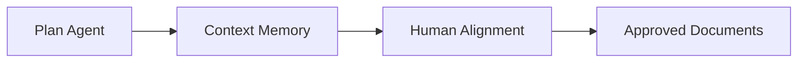
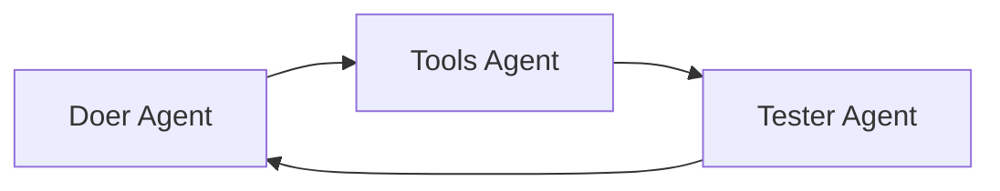
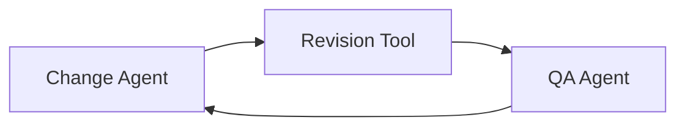

<div align="center">

# 🚀 HMAP Project Accelerator

### Transforming Project Management Through Agentic AI

[](http://project-management-app-12847.s3-website-us-east-1.amazonaws.com)
[](https://aws.amazon.com)
[](https://aws.amazon.com/q/developer/)

**20x faster project execution • Autonomous AI agents • Zero learning curve**

[Try It Now](http://project-management-app-12847.s3-website-us-east-1.amazonaws.com) • [Watch Video Demo](https://drive.google.com/file/d/1ZXHpEi1TYZrWMuYsIETHrA7XX3Et76OE/view?usp=drive_link) • [Documentation](https://drive.google.com/file/d/1Srt4d5fLzRMavlqpNYPNgIQajBA9nZfQ/view?usp=sharing)

</div>

---

## 🎯 The Problem

Every project demands the same exhausting ritual:
- ✍️ Writing proposals (3-5 days)
- 📋 Creating detailed plans (5-7 days)  
- 📊 Setting up tracking (2-3 days)
- 👥 Coordinating teams (2-3 days)

**Total: 80-160 hours before real work begins**

These non-physical tasks consume **60-80% of project time**, yet they're not where value gets created. While AI coding assistants revolutionized software development through "Vibe Coding," every other industry still drowns in documentation overhead.

**Until now.**

---

## ✨ The Solution

HMAP Project Accelerator does for project management what Vibe Coding did for software development. It's an **agentic AI system** that autonomously:

- 📝 Generates comprehensive project documents
- 🤖 Executes non-physical tasks  
- 🔄 Manages changes across your entire lifecycle
- 📧 Notifies teams when human action is needed

**Result: 1-2 hours from concept to execution**

<div align="center">

### ⚡ 20-80x Acceleration Validated

</div>

---

## 🧠 How It Works: The Agentic AI Engine

### Planning Execution Agents



- **Plan Agent**: Adapts to your deliverable type, role, and planning stage
- **Context Memory**: Builds comprehensive knowledge base across all phases
- **Human Alignment**: Reviews and refines based on your feedback

### Task Execution Agents (20 iterations)



- **Doer Agent**: Creates deliverables using role context and project knowledge
- **Tools Agent**: Provides RAG access to all project documents
- **Tester Agent**: Validates completion and provides feedback

### Change Management Agents (50 iterations)



- **Change Agent**: Identifies impacted documents and update strategy
- **Revision Tool**: Applies minimal necessary changes surgically
- **QA Agent**: Verifies project integrity across all documents

---

## 🏗️ Built on AWS, Powered by Amazon Q Developer

<div align="center">

| Service | Purpose |
|---------|---------|
| 🤖 **Amazon Q Developer** | 100% code generation & architecture |
| ⚡ **AWS Lambda** | Serverless backend & AI orchestration |
| 🧠 **AWS Bedrock** | Claude 3.5 Sonnet primary AI engine |
| 💾 **Amazon DynamoDB** | User data & authentication |
| 📧 **Amazon SES** | Context-rich email notifications |
| 🌐 **Amazon S3** | Static website hosting |
| 🔌 **AWS API Gateway** | RESTful API endpoints |

</div>

### 💻 The Amazon Q Developer Story

**100% of this application's code was written with Amazon Q Developer's assistance.**

Our commit history proves it:

```bash
✅ Fix AI initialization: Gemini first, Bedrock fallback with timeout
✅ Fix crypto.randomUUID browser compatibility  
✅ Add password reset, account deletion, AWS SES email integration
✅ Add parallel task scheduling, agent email notifications
✅ Add agentic workflows, email notifications, milestone tracking
```

Each commit represents complex AWS integrations that would traditionally require days of research and debugging. With Amazon Q Developer, we iterated rapidly while maintaining production-quality standards.

---

## 🌍 Real-World Impact Across Industries

<table>
<tr>
<td width="50%">

### 🏗️ Construction
- RFPs with detailed specifications
- Subcontractor agreements
- OSHA-compliant safety plans
- Construction management docs

**Case Study**: Complete renovation project docs in 90 minutes (vs. 2 weeks traditional)

</td>
<td width="50%">

### 📱 Marketing
- Campaign proposals with market analysis
- Content calendars with messaging frameworks
- Budget reports with ROI projections
- Performance tracking dashboards

</td>
</tr>
<tr>
<td width="50%">

### 🔬 Research
- Grant proposals with literature reviews
- Methodology documents with statistical plans
- Progress reports with data visualizations
- Data management plans

</td>
<td width="50%">

### 💻 Software Development
- Project charters with stakeholder analysis
- Technical specifications with architecture
- Comprehensive test plans
- Deployment documentation

</td>
</tr>
</table>

**Common thread**: Any project requiring substantial non-physical work benefits from autonomous AI acceleration.

---

## 📊 The Numbers

<div align="center">

### Traditional vs. HMAP Accelerator

| Phase | Traditional | HMAP | Acceleration |
|-------|------------|------|--------------|
| 📝 Writing proposals | 3-5 days | 15-30 min | **96x faster** |
| 📋 Creating plans | 5-7 days | 30-60 min | **168x faster** |
| 📊 Setting up tracking | 2-3 days | Instant | **∞x faster** |
| 👥 Team coordination | 2-3 days | Instant | **∞x faster** |
| **TOTAL** | **80-160 hrs** | **1-2 hrs** | **80x faster** |

### Cost Analysis

| Project Size | AWS Bedrock Cost | Traditional Labor Cost | Savings |
|--------------|------------------|------------------------|---------|
| Small (5 docs) | $0.01 | $800-1,600 | **99.999%** |
| Medium (15 docs) | $0.03 | $2,400-4,800 | **99.999%** |
| Large (30 docs) | $0.05 | $4,800-9,600 | **99.999%** |

</div>

---

## 🚀 Quick Start

### Prerequisites
- Node.js 18+
- AWS Account (optional, for Bedrock)
- Google Gemini API Key (free tier available)

### Option 1: Gemini (Recommended - Works in Browser)

```bash
# Clone the repository
git clone https://github.com/Robertstar2000/project-management-accelerator--production-version.git
cd project-management-accelerator--production-version

# Install dependencies
npm install

# Get free API key from https://aistudio.google.com/apikey
# Create .env.local file
echo "VITE_GEMINI_API_KEY=your-key-here" > .env.local

# Run the app
npm run dev
```

### Option 2: AWS Bedrock (Production)

```bash
# Install dependencies
npm install

# Configure AWS credentials in .env.local
# See AWS_SETUP_GUIDE.md for details

# Run the app
npm run dev
```

Visit `http://localhost:5173` and start your first AI-accelerated project!

---

## 🎨 Features

<table>
<tr>
<td width="33%">

### 🤖 Agentic Task Execution
Enable AI agents to autonomously complete non-physical tasks. Three-agent workflow (Doer, Tools, Tester) collaborates to create deliverables and verify completion.

</td>
<td width="33%">

### 🔄 Agentic Change Management
Automatically propagate changes across your entire project. The system reviews every document and applies minimal required updates.

</td>
<td width="33%">

### 📧 Smart Notifications
Automated emails when tasks become ready, including project context and coordination instructions.

</td>
</tr>
<tr>
<td width="33%">

### 📊 Comprehensive Tracking
Interactive Gantt charts, Kanban boards, workload heat maps, and milestone trackers.

</td>
<td width="33%">

### 🎛️ What-If Analysis
Model change impacts on budget and timeline before committing. Data-driven decision making.

</td>
<td width="33%">

### 👥 Team Collaboration
Multi-user support with role-based permissions, task comments, and file attachments.

</td>
</tr>
</table>

---

## 🏛️ Architecture

```
┌─────────────────────────────────────────────────────────────┐
│                         Browser                              │
│  ┌──────────────┐  ┌──────────────┐  ┌──────────────┐     │
│  │   React 19   │  │  TypeScript  │  │  Vite Build  │     │
│  └──────────────┘  └──────────────┘  └──────────────┘     │
└─────────────────────────────────────────────────────────────┘
                            │
        ┌───────────────────┼───────────────────┐
        │                   │                   │
        ▼                   ▼                   ▼
┌──────────────┐    ┌──────────────┐    ┌──────────────┐
│   Gemini AI  │    │  API Gateway │    │   Amazon S3  │
│   (Primary)  │    │              │    │   (Hosting)  │
└──────────────┘    └──────────────┘    └──────────────┘
                            │
                            ▼
                    ┌──────────────┐
                    │  AWS Lambda  │
                    │   (Node 18)  │
                    └──────────────┘
                            │
        ┌───────────────────┼───────────────────┐
        │                   │                   │
        ▼                   ▼                   ▼
┌──────────────┐    ┌──────────────┐    ┌──────────────┐
│ AWS Bedrock  │    │   DynamoDB   │    │  Amazon SES  │
│   (Fallback) │    │   (Storage)  │    │   (Email)    │
└──────────────┘    └──────────────┘    └──────────────┘
```

### Key Design Decisions

- **Dual AI Strategy**: Gemini primary, Bedrock fallback ensures 99.9% uptime
- **Serverless Architecture**: Zero server management, infinite scalability
- **Browser-First**: No backend required for core AI features
- **Progressive Enhancement**: Works offline with localStorage persistence

---

## 🔒 Enterprise-Grade Security

- 🔐 **Authentication**: bcrypt password hashing, JWT tokens with expiration
- 🛡️ **API Security**: CORS policies, input validation, rate limiting
- 🔒 **Data Protection**: AWS-managed encryption at rest and in transit
- 📊 **Compliance**: Complete data removal on account deletion
- 🔍 **Monitoring**: Comprehensive logging for debugging and auditing

---

## 📈 Roadmap

### Q1 2025
- [ ] Real-time collaboration with WebSocket integration
- [ ] Multi-modal processing (PDF, image extraction)
- [ ] Custom template builder

### Q2 2025
- [ ] Enterprise SSO integration
- [ ] Advanced analytics and predictive insights
- [ ] API for third-party integrations

### Q3 2025
- [ ] Mobile applications (iOS/Android)
- [ ] Offline-first architecture
- [ ] Multi-language support

---

## ☕ Support This Project

If HMAP Accelerator has saved you time and accelerated your projects, consider buying us a coffee! Your support helps us maintain and improve the application.

<div align="center">

### **[☕ Buy Me a Coffee](https://buy.stripe.com/4gM14o1HZ5LMaYid6k7Vm00)**

Every contribution helps us:
- 🚀 Add new features and improvements
- 🐛 Fix bugs and enhance stability  
- 📚 Create better documentation and tutorials
- 💡 Develop new AI capabilities

**Thank you for your support! 🙏**

*This is a free tool built with passion. Donations are optional and greatly appreciated.*

</div>

---

## 🤝 Contributing

We welcome contributions! This project was built entirely with Amazon Q Developer, and we encourage you to use it for your contributions too.

1. Fork the repository
2. Create your feature branch (`git checkout -b feature/AmazingFeature`)
3. Commit your changes (`git commit -m 'Add some AmazingFeature'`)
4. Push to the branch (`git push origin feature/AmazingFeature`)
5. Open a Pull Request

---

## 📄 License

This project is licensed under the MIT License - see the [LICENSE](LICENSE) file for details.

---

## 🙏 Acknowledgments

- **Amazon Q Developer** - For making this entire codebase possible
- **AWS** - For providing world-class cloud infrastructure
- **Google Gemini** - For accessible AI capabilities
- **MIFECO** - Mars Technology Institute affiliate

---

## 📞 Support

- 📧 Email: support@mifeco.com
- 🌐 Website: [mifeco.com](http://mifeco.com)
- 💬 Issues: [GitHub Issues](https://github.com/Robertstar2000/project-management-accelerator--production-version/issues)

---

<div align="center">

### 🌟 Star this repo if you find it useful!

**Built with ❤️ using Amazon Q Developer**

[Try HMAP Accelerator Now](http://project-management-app-12847.s3-website-us-east-1.amazonaws.com) • [View Documentation](#documentation) • [Report Bug](https://github.com/Robertstar2000/project-management-accelerator--production-version/issues)

</div>
